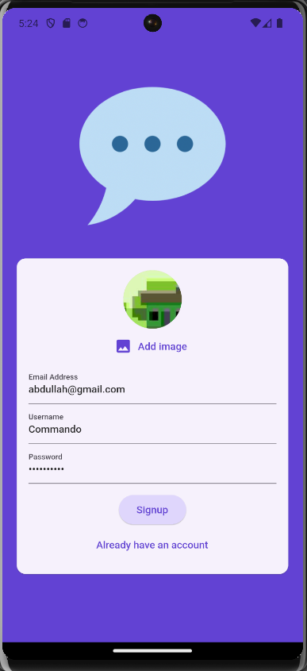
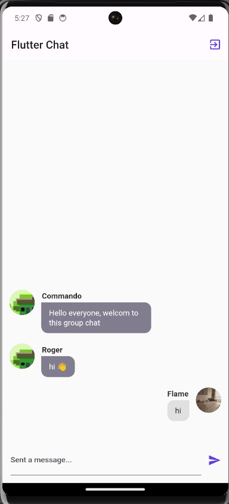

# chat_app

The Chat App is a real-time messaging application that connects users in a seamless and engaging chat experience. Sign up, log in, and start chatting with friends and colleagues effortlessly.

## Screenshots

#### Login Screen



#### Chat Screen



## Features

- **Sign Up & Login**: Create a new account by providing your email, username, password, and selecting a profile image. Alternatively, log in with your existing credentials. Firebase authentication ensures a secure login process.

- **Chat Screen**: Access the main chat screen, where you can view a list of messages. Messages are displayed with the user's profile image and message content. Your messages are on the right side, while others' messages appear on the left.

- **Real-time Messaging**: Experience real-time messaging with instant message delivery. Send and receive messages without delay.

- **Message Input**: Compose and send messages at the bottom of the chat screen using the text input field. Just type your message, press the send icon, and watch it appear in the chat.

## Installation

To try out the Meals App, follow these steps:

1. **Clone the repository to your local machine:**

```
git clone https://github.com/Abd-404/Chat-app.git
```

2. **Navigate to the project directory:**

```
cd Chat-app
```

3. **Setup Firebase**

- Create a firebase project on the [Firebase Console](https://console.firebase.google.com/)
- Set up Firebase Authentication and Firestore.

4. **Install dependencies:**

```
flutter pub get
```

5. **Run the app on your preferred device:**

```
flutter run
```
